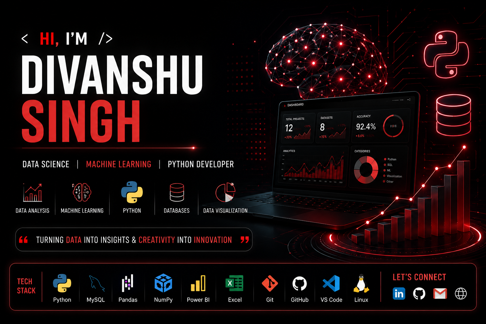

<p align="center">
  
</p>

<h1 align="center">Hi 👋, I'm Divanshu Singh</h1>

<h3 align="center">
Data Science Enthusiast • Python Developer • Future Machine Learning Engineer
</h3>

<p align="center">
🎬 Passionate about Animation & Creative Technology • 📊 Turning Data into Insights
</p>

<p align="center">
  
</p>

<p align="center">
  <a href="https://github.com/divanshusingh-ds">
    
  </a>
</p>

---
---

# 🚀 About Me


Hi! I'm **Divanshu Singh**, a passionate **Data Science Enthusiast**, **Python Developer**, and aspiring **Machine Learning Engineer** with a creative vision beyond technology.

I love transforming raw data into meaningful insights while exploring the exciting intersection of **Artificial Intelligence, Data Science, Animation, and Creative Technology.**

Whether I'm building dashboards, writing Python code, analyzing datasets, or imagining the next generation of animated experiences, I enjoy turning ideas into reality.

---

## 🌱 Currently Learning

- 🤖 Machine Learning
- 🧠 Deep Learning
- 📊 Data Visualization
- 🐍 Advanced Python
- 🗄 SQL & Database Optimization
- 📈 Power BI

---

## 🎬 Passion for Animation

Animation has always been one of my biggest passions.

I'm fascinated by storytelling, world-building, character design, visual effects, and the technology behind animated films.

My long-term vision is to combine **AI, Data Science, and Animation** to create innovative experiences that inspire millions of people.

---

## 🎯 Career Vision

My goal is to build products where

- 📊 Data drives decisions
- 🤖 AI solves real-world problems
- 🎬 Animation tells unforgettable stories
- 🚀 Creativity meets technology

---

## 💡 Personal Quote

> **"When skill, knowledge, and vision meet no open door, build your own — and the ones who once wanted to walk with you will finally get their chance."**
>
> **— Divanshu Singh**
# 🛠 Tech Stack

<p align="center">


</p>

## 💻 Programming Languages

<p align="center">


</p>

---

## 📚 Data Science

<p align="center">


</p>

---

## 📊 Visualization

<p align="center">


</p>

---

## ⚙ Tools

<p align="center">


</p>
# 🎬 Beyond Data Science

Most people know me as a Data Science enthusiast.

But beyond datasets and machine learning, I have a deep passion for **Animation, Storytelling, and Creative Technology.**

I believe the future belongs to creators who can combine **technology with imagination**, and that's the journey I'm building every day.
---

# 📊 GitHub Analytics

<p align="center">


</p>

---

# 🔥 GitHub Streak

<p align="center">


</p>

---

# 📈 Contribution Graph

<p align="center">


</p>

---

# 🏆 GitHub Trophies

<p align="center">


</p>

---

# 🐍 Contribution Snake

<p align="center">


</p>
---

# 🚀 Featured Projects

<p align="center">

<a href="https://github.com/divanshusingh-ds/movie-studio-analytics-sql-python">

</a>

<a href="https://github.com/divanshusingh-ds/fifa-world-cup-2026-python-analysis-">

</a>

<a href="https://github.com/divanshusingh-ds/NETFLIX-PYTHON-PROJECT">

</a>

<a href="https://github.com/divanshusingh-ds/Netflix-PowerBI-Dashboard">

</a>

<a href="https://github.com/divanshusingh-ds/disney-dashboard-excel">

</a>

<a href="https://github.com/divanshusingh-ds/imdb-sql-analysis">

</a>

</p>

---
---

# 🎯 2026 Goals

- 🚀 Build 25+ High-Quality Data Science Projects
- 🤖 Master Machine Learning & Deep Learning
- 📊 Create Interactive Dashboards with Power BI
- 🐍 Become an Advanced Python Developer
- 🎬 Learn Animation & Creative Technology
- 🌍 Contribute to Open Source Projects
- 💼 Land a Data Science / Machine Learning Role
- 🎨 Combine AI, Data Science & Animation into innovative products

---

# 🏅 Achievements

✔ Data Science Projects

✔ SQL Analytics Projects

✔ Python Automation & Analysis

✔ Power BI Dashboards

✔ Excel Dashboards

✔ Git & GitHub Portfolio

✔ Continuous Learning in AI & Machine Learning

---

# 💼 Areas of Interest

- 📊 Data Science
- 🤖 Artificial Intelligence
- 🧠 Machine Learning
- 📈 Business Intelligence
- 🎬 Animation
- 🎮 Creative Technology
- 💡 Innovation
- 🚀 Product Development

---

# 🌐 Connect With Me

<p align="center">

<a href="https://www.linkedin.com/in/divanshu-singh925">

</a>

<a href="mailto:singhdivanshu455@gmail.com">

</a>

<a href="https://singhdivanshu455-star.github.io/my-project/">

</a>

</p>

---

# 💭 Personal Quote

> **"When skill, knowledge, and vision meet no open door, build your own — and the ones who once wanted to walk with you will finally get their chance."**

<p align="right">
<b>— Divanshu Singh</b>
</p>

---

# ⚡ Fun Facts

- 🎬 Animation enthusiast
- 📊 Love discovering insights from data
- 🧩 Enjoy solving analytical problems
- 🚀 Always learning something new
- 💻 Turning ideas into real-world projects

---

<h2 align="center">

⭐ Thanks for Visiting My GitHub Profile ⭐

</h2>

<p align="center">

<b>Turning Data into Insights • Creativity into Innovation • Ideas into Reality</b>

</p>

<p align="center">

If you like my work, don't forget to ⭐ my repositories!

</p>
---

# 🌟 Current Focus

```text
📊 Data Science          ███████████░░░ 85%
🐍 Python                ███████████░░░ 85%
🗄 SQL                   ████████████░░ 90%
📈 Power BI              ██████████░░░░ 80%
🤖 Machine Learning      ███████░░░░░░░ 60%
🧠 Deep Learning         █████░░░░░░░░░ 45%
🎬 Animation             ████████░░░░░░ 65%
```

---

# 📚 Currently Exploring

- 🤖 Artificial Intelligence
- 🧠 Machine Learning
- 🎬 Animation Technology
- 📊 Business Intelligence
- 🏗 Data Engineering Basics

---

# 💖 Support My Work

If you enjoy my projects, consider giving a ⭐ to my repositories.

Every star motivates me to build better projects and learn something new.

---

# 💻 Favorite Technologies

<p align="center">


</p>

---

# 🌍 My Vision

I believe technology is not just about writing code.

It's about solving problems, creating experiences, and inspiring people.

My dream is to build products where

🤖 Artificial Intelligence

📊 Data Science

🎬 Animation

🚀 Creativity

work together to create something meaningful.

---

# 🎯 Motto

> **Learn. Build. Improve. Repeat.**

---

<h2 align="center">

⭐ Thank You for Visiting ⭐

</h2>

<h3 align="center">

Let's Build the Future Together 🚀

</h3>

<p align="center">

Made with ❤️ by <b>Divanshu Singh</b>

</p>
# 🌠 My Dream

I'm not only passionate about Data Science.

I'm also deeply interested in Animation, Storytelling and Creative Technology.

My long-term vision is to combine Artificial Intelligence, Data Science and Animation to create innovative experiences that educate, entertain and inspire people around the world.
