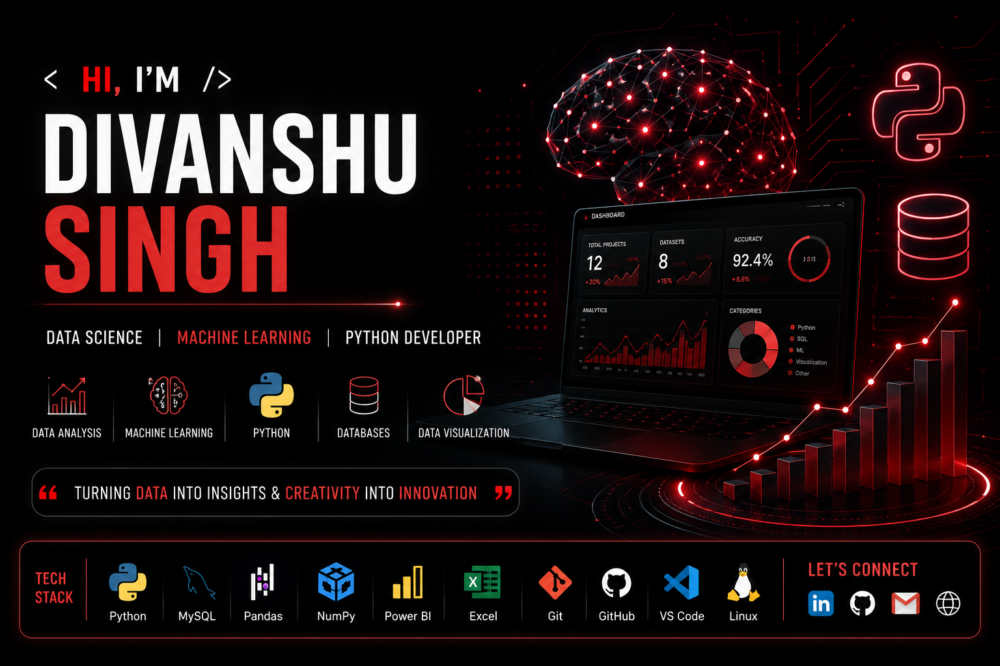

<!-- BANNER SECTION -->
<p align="center">
  
</p>

<!-- HEADER -->
<h1 align="center">
  
</h1>

<!-- SUBTITLE -->
<p align="center">
  
  
  
  
</p>

<!-- PROFILE VIEWS -->
<p align="center">
  <a href="https://github.com/divanshusingh-ds">
    
  </a>
  <a href="https://github.com/divanshusingh-ds?tab=followers">
    
  </a>
  <a href="https://github.com/divanshusingh-ds?tab=repositories">
    
  </a>
</p>

---

## 🎯 About Me

<table>
<tr>
<td width="60%">

### 👨‍💻 Who I Am

I'm **Divanshu Singh** — a passionate **Data Science Enthusiast**, **Python Developer**, and aspiring **Machine Learning Engineer**.

> 🎯 Turning **Data into Insights** • Creativity into **Innovation**

### 💡 What Drives Me

- 🤖 Building AI-powered solutions
- 📊 Uncovering hidden patterns in data
- 🎬 Exploring Animation & Creative Tech
- 🚀 Combining tech with imagination

### 🎯 Current Mission

Building projects where **AI, Data Science & Animation** converge to create experiences that educate and inspire millions.

</td>
<td width="40%" align="center">


</td>
</tr>
</table>

---

## 🛠️ Technical Arsenal

### 💻 Languages
<p align="left">
  
  
</p>

### 📊 Data Science Stack
<p align="left">
  
  
  
  
  
</p>

### 📈 Visualization Tools
<p align="left">
  
  
</p>

### 🧰 Development Tools
<p align="left">
  
  
  
  
  
</p>

---

## 🚀 Featured Projects

<table>
<tr>
<td width="50%">

### 🎬 Movie Studio Analytics
[](https://github.com/divanshusingh-ds/movie-studio-analytics-sql-python)

**SQL • Python • Pandas • Power BI**

End-to-end analytics exploring movie performance & business insights.

</td>
<td width="50%">

### ⚽ FIFA World Cup 2026 Analysis
[](https://github.com/divanshusingh-ds/fifa-world-cup-2026-python-analysis-)

**Python • Pandas • Matplotlib • Seaborn**

Statistical analysis & visualization of FIFA World Cup trends.

</td>
</tr>
<tr>
<td width="50%">

### 📺 Netflix EDA
[](https://github.com/divanshusingh-ds/NETFLIX-PYTHON-PROJECT)

**Python • Pandas • NumPy • Matplotlib • Seaborn**

Exploratory Data Analysis on Netflix Movies & TV Shows.

</td>
<td width="50%">

### 📊 Netflix Power BI Dashboard
[](https://github.com/divanshusingh-ds/Netflix-PowerBI-Dashboard)

**Power BI • DAX • Data Visualization**

Interactive dashboard with Netflix content insights & KPIs.

</td>
</tr>
<tr>
<td width="50%">

### 🎥 Disney Dashboard (Excel)
[](https://github.com/divanshusingh-ds/disney-dashboard-excel)

**Excel • Pivot Tables • Charts**

Interactive dashboard for Disney content analysis.

</td>
<td width="50%">

### 🎞 IMDb SQL Analysis
[](https://github.com/divanshusingh-ds/imdb-sql-analysis)

**SQL • MySQL**

Analyzing IMDb movie ratings, genres, and trends.

</td>
</tr>
</table>

---

## 📈 GitHub Analytics

<p align="center">
  
  
</p>

<p align="center">
  
</p>

<p align="center">
  
</p>

---

## 🏆 Achievements & Trophies

<p align="center">
  
</p>

---

## 🎯 2026 Roadmap

```mermaid
timeline
    title 2026 Goals
    Q1 : Master Advanced Python
        : 10+ Data Science Projects
    Q2 : Machine Learning Expertise
        : Deep Learning Basics
    Q3 : Animation & Creative Tech
        : Open Source Contributions
    Q4 : Land ML/DS Role
        : Launch AI+Animation Product
